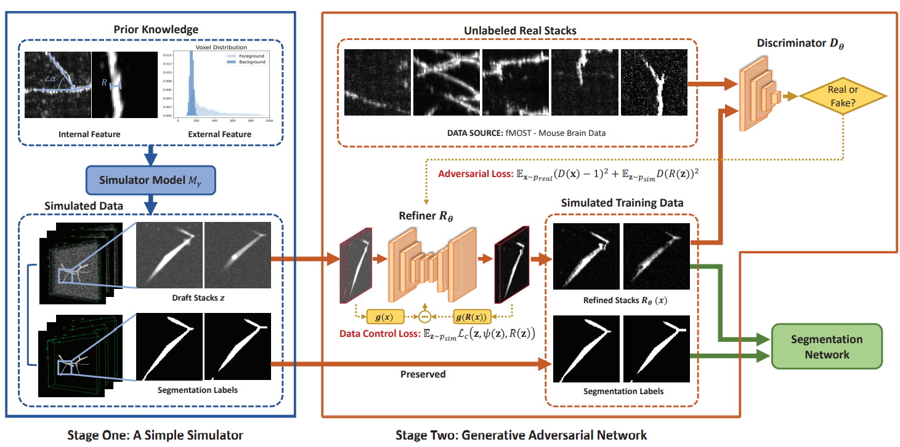
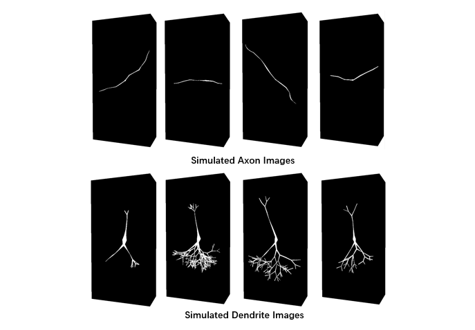
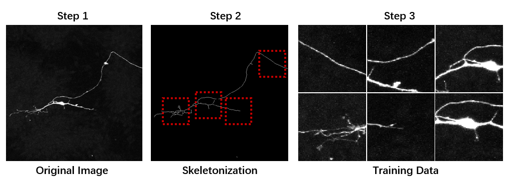

# MPGAN

Implementation of the paper **Using Simulated Training Data of Voxel-level Generative Model to Improve 3D Neuron Reconstruction**. 

## Introduction

In this paper, we propose a novel strategy of using two-stage generative models to simulate training data with voxel-level labels (MPGAN). Trained upon unlabeled data by optimizing a novel objective function of preserving predefined labels, the models are able to synthesize realistic 3D images with underlying voxel labels. The framework of MPGAN model is shown as follow:

	

## Getting Started

### Prerequisites

- Linux 
- NVIDIA GPU
- TensorFlow==1.15.0

### Installation

- Clone this repo:

```python
git clone https://github.com/CSDLLab/MPGAN.git
cd MPGAN
```

- Create virtual environment and install required packages:

```python
conda create -n mpgan
conda activate mpgan
conda install --yes --file requirements.txt
```


## Usage

### First Stage: Neuron Image Simulator 

- Use first-stage simulator to generate the fake images:


```python
python 1_simulator.py
```

- The output images are shown in follow figure:

	

### Second Stage: GAN

- Use second-stage MPGAN to refine the fake images:

```python
python 2_mpgan.py
```

## Data

Due to the size of each individual stack, which can be as big as 512 * 512 * 512, it is not practical to input the whole stack into a deep neural network. Instead, we use small patches with the size of 64 * 64 * 32. To exclude patches containing too few foreground voxels, we use a sliding window  to traverse each stack. 

- Use OTSU to segment the image. 

- Skeletonize the neuron image to get the neuron centerline. 

- Slide the window to traverse the image on centerline  to ensure that the neuron branches are centered in the training data.

	


## Reference

If you find MPGAN useful in your work, please consider citing our paper:

```
@article{liu2022using,
  title={Using simulated training data of voxel-level generative models to improve 3D neuron reconstruction},
  author={Liu, Chao and Wang, Deli and Zhang, Han and Wu, Wei and Sun, Wenzhi and Zhao, Ting and Zheng, Nenggan},
  journal={IEEE transactions on medical imaging},
  volume={41},
  number={12},
  pages={3624--3635},
  year={2022},
  publisher={IEEE}
}
```

